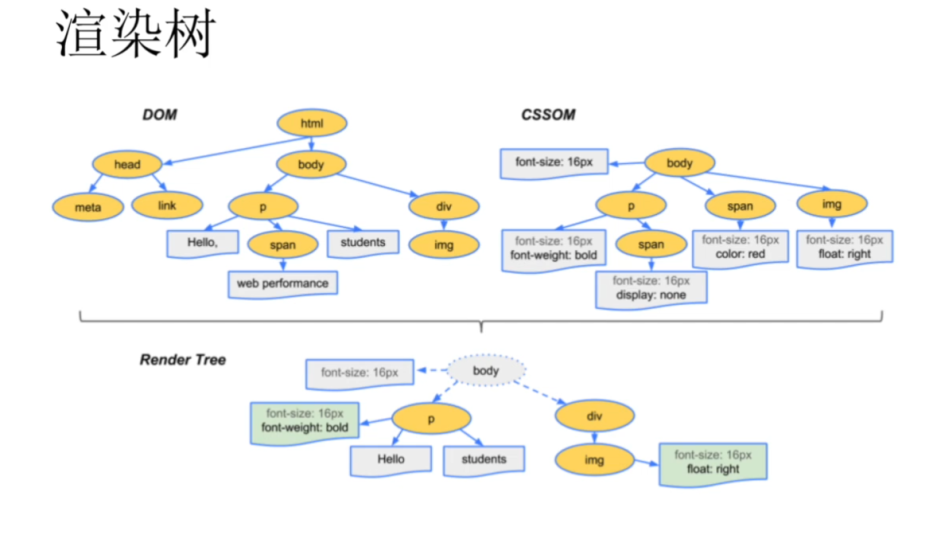

## DOM/CSS 渲染树，解析与加载，回流与重绘

### 1.解析

DOM 树的构建 也就是对 html 的**解析** 

### 2.加载

加载内部资源，或者外部资源，是在解析之后开始的，属于异步

### 3. Render Tree 渲染树

dom Tree + css Tree = Render Tree 1.渲染树每个节点都有自己的样式 2.不包含隐藏节点 ：display:none , head 之类不需要绘制的节点 3.visibility：hidden 相对应的节点是包含在渲染树上的，（占有空间影响布局） 4.渲染树上的每一个节点都会被当作一个盒子 box，具有内容填充，边距，边框，位置，大小，其他样式

** render tree 构建完毕后浏览器它绘制页面**

### 4.回流 （reflow）

回流一定会引起重绘，而重绘不一定是回流产生的后续 当 js 操作页面的节点时，就会产生回流或者重绘 节点的尺寸，布局，display：none block，等一些改变的时候，渲染树中的一部分或者全部需要重新构建 称之为**回流** **只要加载页面一定会引起回流，因为会构建 render Tree 渲染页面** **导致回流的因素**：

1. DOM 节点增加，删除
2. DOM 节点位置变化（margin，top，。。。）
3. 元素的尺寸大小，边距，填充，边框，宽高
4. DOM 节点 display 显示与否
5. 页面的渲染初始化
6. 浏览器窗口尺寸变化（resize）也会影响回流
7. 向浏览器请求某些样式信息 (offset, scroll,client,width,height),getComputedStyle 等

**回流比重绘的代价更高，产生的性能问题比重绘多的多的多**

### 5.重绘（repaint）

回流时，浏览器会看重新构建受印象部分的渲染树，就一定会引起重绘 ** 回流完成后，浏览器会根据新的渲染树重新回值回流影响的部分节点，这个重新绘制的过程为重绘** 1. 

假如我们创建一个节点然后添加在 body 最后，那么浏览器会发生一次 dom Tree 的构建以及 render Tree 的重新渲染，以及回流和重绘， 可是当我们使用 insertBefore 时将节点添加到 body 最上面那么所有的节点都需要重新经过 dom Tree 的构建以及 render Tree 的渲染，以及它们的回流和重绘，如果选择在 div.box 中最顶端插入，也是会引起 box 内里面所有盒子 dom Tree 的构建，以及 render Tree 的渲染，以及它们的回流和重绘 **因此我们应该减少使用 insertBefore 来插入元素** **2.**  通过加类名的方式可以只引起一次回流和一次重绘，这属于一种批量处理 通过文档碎片来减少重绘和回流的次数从而提高性能从 10 次减少为一次 3.  文档碎片 docuent.createDocumentFragment()不占 dom 树以及渲染树里面， 4.  通过一次显示与隐藏只有 2 次回流与重绘，而中间所有的代码都不在 dom 树以及渲染树中出现，不会增加重绘和回流的渲染次数

5.动画 元素 一定要绝对定位，让它脱离标准流，不然出现位置的变化会不断的回流和重绘，采用定位控制元素的方位不对其他节点产生回流与重绘

6.tabel 布局回流的代价相当大，第一次加载回流的性能就很大，我们应该尽可能不使用 table

### 6.页面渲染过程

  [js 全修班笔记](https://blog.csdn.net/qq_42647547/category_11206026.html)
