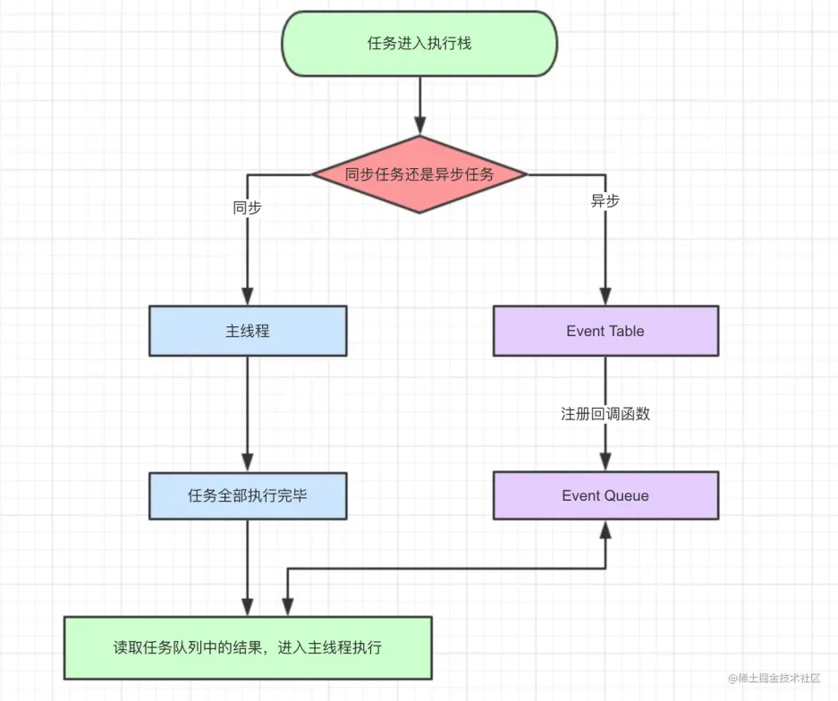
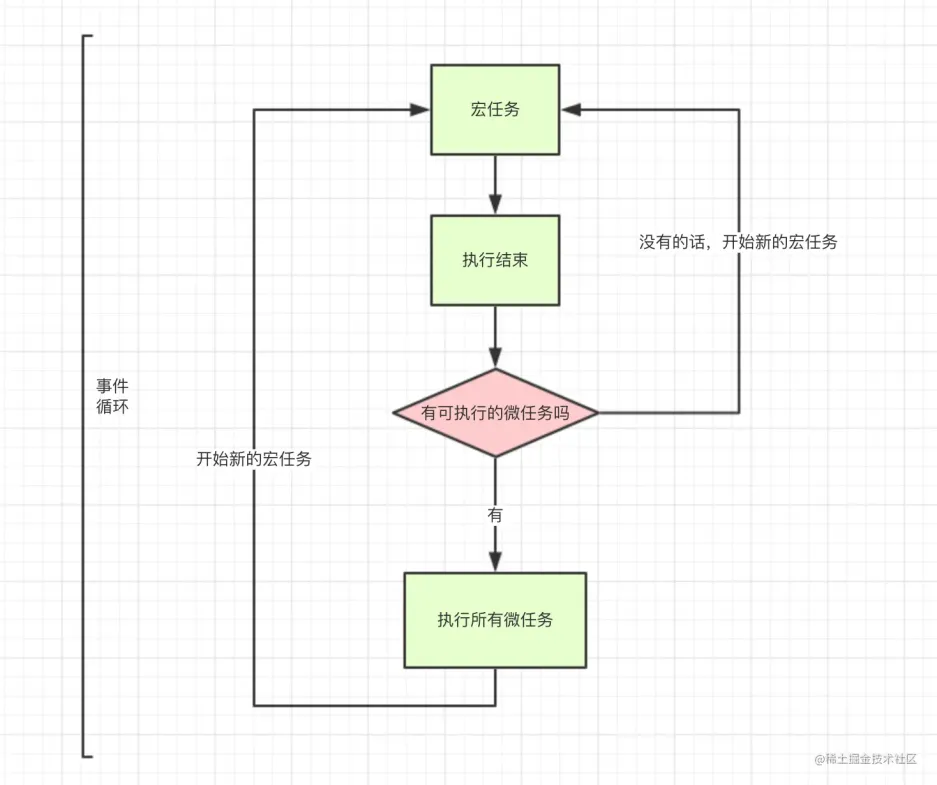

# Event loop

既然 js 是单线程，那就像只有一个窗口的银行，客户需要排队一个一个办理业务，同理 js 任务也要一个一个顺序执行。如果一个任务耗时过长，那么后一个任务也必须等着。那么问题来了，假如我们想浏览新闻，但是新闻包含的超清图片加载很慢，难道我们的网页要一直卡着直到图片完全显示出来？因此聪明的程序员将任务分为两类：

- **同步任务**
- **异步任务**

当我们打开网站时，网页的渲染过程就是一大堆同步任务，比如页面骨架和页面元素的渲染。而像加载图片音乐之类占用资源大耗时久的任务，就是异步任务。关于这部分有严格的文字定义，但本文的目的是用最小的学习成本彻底弄懂执行机制，所以我们用导图来说明：

- 同步和异步任务分别进入不同的执行"场所"，同步的进入主线程，异步的进入 Event Table 并注册函数。
- 当指定的事情完成时，Event Table 会将这个函数移入 Event Queue。
- 主线程内的任务执行完毕为空，会去 Event Queue 读取对应的函数，进入主线程执行。
- 上述过程会不断重复，也就是常说的 Event Loop(事件循环)。

<br />除了广义的同步任务和异步任务，我们对任务有更精细的定义：

- **macro-task(宏任务)：包括整体代码 script，setTimeout，setInterval**
- **micro-task(微任务)：Promise，process.nextTick**

**不同类型的任务会进入对应的 Event Queue，比如 setTimeout 和 setInterval 会进入相同的 Event Queue。**<br />**事件循环的顺序，决定 js 代码的执行顺序。进入整体代码(宏任务)后，开始第一次循环。接着执行所有的微任务。然后再次从宏任务开始，找到其中一个任务队列执行完毕，再执行所有的微任务。听起来有点绕，我们用文章最开始的一段代码说明**：



//例题

```javascript
console.log('1')

setTimeout(function () {
	console.log('2')
	process.nextTick(function () {
		console.log('3')
	})
	new Promise(function (resolve) {
		console.log('4')
		resolve()
	}).then(function () {
		console.log('5')
	})
})
process.nextTick(function () {
	console.log('6')
})
new Promise(function (resolve) {
	console.log('7')
	resolve()
}).then(function () {
	console.log('8')
})

setTimeout(function () {
	console.log('9')
	process.nextTick(function () {
		console.log('10')
	})
	new Promise(function (resolve) {
		console.log('11')
		resolve()
	}).then(function () {
		console.log('12')
	})
})
```

第一轮事件循环流程分析如下：

- 整体 script 作为第一个宏任务进入主线程，遇到 console.log，输出 1。
- 遇到 setTimeout，其回调函数被分发到宏任务 Event Queue 中。我们暂且记为 setTimeout1。
- 遇到 process.nextTick()，其回调函数被分发到微任务 Event Queue 中。我们记为 process1。
- 遇到 Promise，new Promise 直接执行，输出 7。then 被分发到微任务 Event Queue 中。我们记为 then1。
- 又遇到了 setTimeout，其回调函数被分发到宏任务 Event Queue 中，我们记为 setTimeout2。
  | 宏任务 Event Queue | 微任务 Event Queue |
  | --- | --- |
  | setTimeout1 | process1 |
  | setTimeout2 | then1 |

- 上表是第一轮事件循环宏任务结束时各 Event Queue 的情况，此时已经输出了 1 和 7。
- 我们发现了 process1 和 then1 两个微任务。
- 执行 process1,输出 6。
- 执行 then1，输出 8。

好了，第一轮事件循环正式结束，这一轮的结果是输出 1，7，6，8。那么第二轮时间循环从 setTimeout1 宏任务开始：

- 首先输出 2。接下来遇到了 process.nextTick()，同样将其分发到微任务 Event Queue 中，记为 process2。new Promise 立即执行输出 4，then 也分发到微任务 Event Queue 中，记为 then2。
  | 宏任务 Event Queue | 微任务 Event Queue |
  | --- | --- |
  | setTimeout2 | process2 |
  | | then2 |

- 第二轮事件循环宏任务结束，我们发现有 process2 和 then2 两个微任务可以执行。
- 输出 3。
- 输出 5。
- 第二轮事件循环结束，第二轮输出 2，4，3，5。
- 第三轮事件循环开始，此时只剩 setTimeout2 了，执行。
- 直接输出 9。
- 将 process.nextTick()分发到微任务 Event Queue 中。记为 process3。
- 直接执行 new Promise，输出 11。
- 将 then 分发到微任务 Event Queue 中，记为 then3。
  | 宏任务 Event Queue | 微任务 Event Queue |
  | --- | --- |
  | | process3 |
  | | then3 |

- 第三轮事件循环宏任务执行结束，执行两个微任务 process3 和 then3。
- 输出 10。
- 输出 12。
- 第三轮事件循环结束，第三轮输出 9，11，10，12。

整段代码，共进行了**三次事件循环**，完整的输出为 1，7，6，8，2，4，3，5，9，11，10，12。 (请注意，node 环境下的事件监听依赖 libuv 与前端环境不完全相同，输出顺序可能会有误差)
